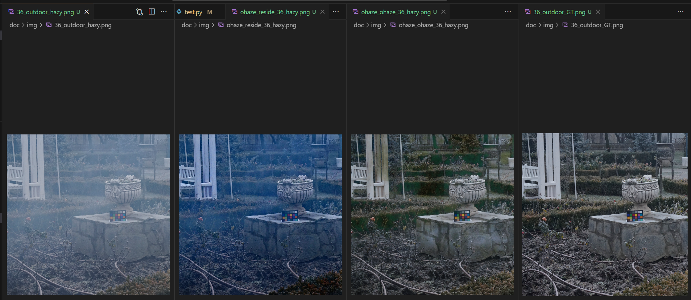

# 结构相似性（SSIM）

SSIM 是一种用于比较两幅图像相似性的指标，它综合了亮度、对比度和结构三个方面的信息。SSIM 的计算基于人类视觉系统的感知机制，旨在提供更好地反映人眼对图像质量感知的指标。

## SSIM 计算过程

1. **亮度比较（Luminance Comparison）：** 计算图像的亮度平均值。亮度在 SSIM 中对应于图像的均值。
2. **对比度比较（Contrast Comparison）：** 计算图像的标准差，反映图像的对比度。对比度在 SSIM 中对应于图像的标准差。
3. **结构比较（Structure Comparison）：** 通过计算图像的互相关系数，衡量图像的结构相似度。结构在 SSIM 中对应于图像的结构信息。

## SSIM 公式

SSIM 公式的一般形式如下：

$$
\text{SSIM}(x, y) = \frac{{(2\mu_x\mu_y + C_1)(2\sigma_{xy} + C_2)}}{{(\mu_x^2 + \mu_y^2 + C_1)(\sigma_x^2 + \sigma_y^2 + C_2)}}
$$

其中：

- $x$ 和 $y$ 是待比较的两幅图像。
- $\mu_x$、$\mu_y$ 分别是 $x$ 和 $y$ 的亮度均值。
- $\sigma_x$、$\sigma_y$ 分别是 $x$ 和 $y$ 的标准差。
- $\sigma_{xy}$ 是 $x$ 和 $y$ 之间的协方差。
- $C_1$ 和 $C_2$ 是为了稳定性而添加的常数。

SSIM 越接近 1，表示两幅图像越相似；越接近 0，表示两幅图像越不相似。

# 峰值信噪比（PSNR）

PSNR（Peak Signal-to-Noise Ratio，峰值信噪比）是一种用于度量图像质量的指标。它通过比较图像的原始版本和经过压缩或其他处理后的版本之间的差异来评估图像的失真程度。PSNR的计算基于图像的峰值信号和均方误差之比，通常用来衡量压缩算法的性能，以及在图像处理中的信号失真程度。

PSNR的计算公式为：

$$
\text{PSNR} = 10 \cdot \log_{10} \left( \frac{{\text{MAX}^2}}{{\text{MSE}}} \right)
$$

其中：
- $\text{MAX}$ 是图像中像素值的最大可能值（通常为255，对于8位图像）。
- $\text{MSE}$ 是图像的均方误差（Mean Squared Error），即原始图像与处理后图像之间的差异的平方和的均值。

PSNR的值越高，表示图像的质量损失越小，失真程度越低。

# 实验结果

## 测试1：20000 epoch train_ohaze（使用ohaze数据集训练与测试）

| Image (Outdoor) | PSNR    | SSIM    | VIF     | MSE     |
|-----------------|---------|---------|---------|---------|
| 40_outdoor_hazy | 22.5420 | 0.7586  | 0.7643  | 0.0056  |
| 39_outdoor_hazy | 20.1145 | 0.7143  | 0.7728  | 0.0097  |
| 38_outdoor_hazy | 23.5469 | 0.7781  | 1.0254  | 0.0044  |
| 37_outdoor_hazy | 22.3279 | 0.6981  | 0.7238  | 0.0059  |
| 36_outdoor_hazy | 22.6933 | 0.7549  | 0.7318  | 0.0054  |

**Average:**
- L1 Loss: 0.059564
- Average PSNR: 22.244909
- Average SSIM: 0.740812
- Average VIF: 0.803607
- Average MSE: 0.006191

## 测试2：40000 epoch train（使用RESIDE数据集训练与测试）

### 在RESIDE数据测试集中测试

**Average**
- L1 Loss: 0.012660 
- Average PSNR: 34.958425
- Average SSIM: 0.974524
- Average VIF: 1.006431
- Average MSE: 0.000359

### 在ohaze数据测试集中测试

| Image (Outdoor) | PSNR    | SSIM    | VIF     | MSE     |
|-----------------|---------|---------|---------|---------|
| 40_outdoor_hazy | 17.6797 | 0.6992  | 0.7826  | 0.0171  |
| 39_outdoor_hazy | 14.7837 | 0.6493  | 0.4540  | 0.0332  |
| 38_outdoor_hazy | 14.8198 | 0.6975  | 0.5917  | 0.0330  |
| 37_outdoor_hazy | 16.3474 | 0.6416  | 0.4661  | 0.0232  |
| 36_outdoor_hazy | 18.1092 | 0.6869  | 0.5297  | 0.0155  |

**Average:**
- L1 Loss: 0.120498
- Average PSNR: 16.347973
- Average SSIM: 0.674902
- Average VIF: 0.564828
- Average MSE: 0.024381

## 可视化1：ohaze测试集，不同训练集下效果对比
从左至右分别为原始带雾图片，RESIDE数据集训练后测试，OHAZE数据集训练后测试，无雾图

## 只修改预测T的_version_1

[SOTS] L1: 0.012674, PSNR: 34.955098, SSIM: 0.974479, VIF: 1.006637, MSE: 0.000360

## 修改预测T的并增加了dialtion_version_2

### HazeRD训练，SOTS测试
[SOTS] L1: 0.102853, PSNR: 17.769336, SSIM: 0.775961, VIF: 0.840989, MSE: 0.019193

## 增加了颜色损失函数和最大化对比度_version_4

[SOTS] L1: 0.080793, PSNR: 20.157936, SSIM: 0.867605, VIF: 0.955109, MSE: 0.015375
